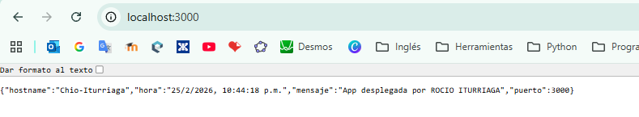

\# App Backend - Computo en la Nube - Codificación y Preparación de Microservicio de Diagnóstico

\## Descripción:

Aplicación backend desarrollada con Node.js y Express.

La aplicación responde a una petición HTTP mostrando:

\- Nombre del servidor (Hostname): Chio-Iturriaga

\- Hora actual del sistema

\- Mensaje personalizado: App desplegada por ROCIO ITURRIAGA

\- Puerto dinámico: 3000

\## Requisitos

\- Node.js instalado

\## Instalación

1\. Clonar el repositorio:

git clone https://github.com/RocioIB/app-backend.git

2\. Entrar a la carpeta:

cd app-backend

3\. Instalar dependencias:

npm install

\## Ejecución

Ejecutar el servidor con:

node index.js

O definir un puerto personalizado:

set PORT=4000

node index.js

La aplicación estará disponible en:

http://localhost:3000

\## Evidencia

